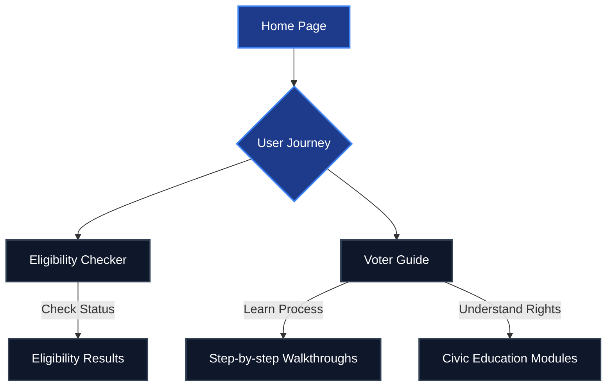

# Election Guide AI 🗳️

Welcome to **Election Guide AI**, a premium, professional-grade civic education platform designed to empower voters with clear, accessible, and comprehensive information about the voting process.

## 🌟 Overview

Election Guide AI transforms the complex voting process into an engaging and easy-to-understand journey. Built with a modern aesthetic featuring glassmorphism, dynamic animations, and a premium blue-gradient color palette, the application ensures that learning about your civic duties is both visually stunning and highly educational.

## ✨ Key Features

- **Eligibility Checker:** A quick, interactive tool to help users determine if they meet the requirements to vote.
- **Progressive Learning Paths:** Structured educational content tailored to different levels of voter experience.
- **Step-by-Step Walkthroughs:** Clear, actionable guides detailing the entire voting process from registration to casting a ballot.
- **Modern User Experience:** Smooth micro-animations, a responsive layout, and an intuitive interface designed for all devices.
- **Containerized Deployment:** Dockerized and ready for scalable deployment on platforms like Google Cloud Run.

## 🏗️ Architecture & User Flow

The application is structured to guide users naturally through the educational process:



## 💻 Technology Stack

- **Frontend:** React.js, Vite
- **Styling:** Vanilla CSS (Custom Design System with CSS variables and Glassmorphism)
- **Routing:** React Router DOM
- **Deployment:** Docker, Nginx, Google Cloud Run

## 🚀 Getting Started Locally

To run the project locally on your machine:

1. **Clone the repository:**
   ```bash
   git clone https://github.com/12austin12/Electionguide1.git
   cd Electionguide1
   ```

2. **Install dependencies:**
   ```bash
   npm install
   ```

3. **Run the development server:**
   ```bash
   npm run dev
   ```

4. **Build for production:**
   ```bash
   npm run build
   ```

## 🐳 Docker Deployment

The application includes a multi-stage `Dockerfile` optimized for production using Nginx.

```bash
# Build the image
docker build -t electionguide .

# Run the container
docker run -p 8080:8080 electionguide
```
